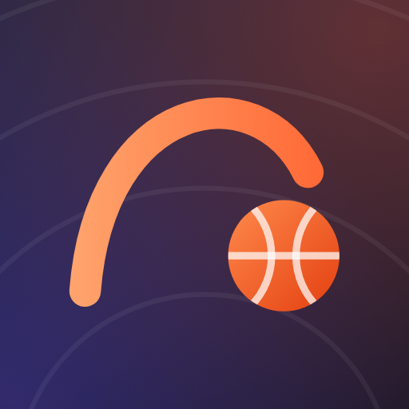

# ArcVanta AI

Advanced basketball intelligence for iOS and Android. The app turns a single
phone on a tripod into a shooting measurement system: it counts makes and
attempts, locates every shot on the floor, measures release and arc mechanics
from pose, and explains what changed between sessions.

The product rule that shapes every screen: **never show a number the camera
could not actually measure.** Metrics that a given camera placement cannot
support are marked unavailable with the placement that would measure them, and
every value carries a confidence level derived from calibration, detection and
tracking quality.

## Design language

The interface is called *Hardwood and Ink*. It is deliberately not a dark glass
theme.

| Token | Value | Used for |
| --- | --- | --- |
| Canvas | warm parchment | app background, keeps long reading sessions calm |
| Ink | deep indigo with a court-line texture | hero panels, scoreboards, capture surfaces |
| Flare | orange | the shooting action, primary calls to action, live state |
| Court | teal | capture, calibration and camera concepts |
| Insight | violet | analysis, comparison and coaching intelligence |
| Made / Miss | green / red | shot outcomes only, never decoration |

Type is Archivo for headings and metrics, Inter for body, with tabular figures
wherever numbers change in place. All spacing, radii, shadow and motion values
come from `lib/core/theme/av_tokens.dart`; nothing in the feature layer defines
its own.

Splash, onboarding, auth, role, player setup and guardian consent all sit on the
ink surface via `AvBrandScaffold`, so the product has one branded front door.
The workspace behind it stays on the parchment canvas, which is what stands up
to a bright gym.

### The launcher icon



The mark is a painter, not artwork, and both the launcher icon and the in-app
`AvLogoMark` draw it from `lib/design/brand/app_icon_art.dart`. Regenerate every
platform asset after editing it:

```bash
flutter test tool/generate_app_icon.dart
```

That writes the iOS asset catalogue, the Android legacy bitmaps, the adaptive
background and foreground layers, the themed-icon silhouette and the review
image above. Each size is drawn at its own resolution rather than downsampled
from one master. iOS icons are re-encoded without an alpha channel, which App
Store Connect rejects, and the adaptive layers are checked to stay within
Android's 66dp safe circle.

## Running it

```bash
flutter pub get
flutter run
```

Built and verified against Flutter 3.44.2 with Dart 3.12.

The app ships with a deterministic seeded dataset (`lib/data/seed`) covering
nineteen sessions, a six-athlete roster, a training plan, goals, highlights and
notifications, so every screen is populated without a backend. The live session
screen simulates the capture pipeline, including pose animation, shot phases and
event timing.

## Layout of the code

```
lib/
  core/                theme tokens, colours, typography, router, formatters
  data/
    calibration/       camera model, conics, rim pose, court frame, solver
    capture/           the CaptureSource seam, model contract, native bridge
    analysis/          shot segmentation and measurement from detections
    models/            the domain types, metric catalog, seeded data
  design/              the component library: surfaces, buttons, charts, painters
  features/            one folder per area of the product
  state/               Riverpod stores and app settings

android/app/src/main/kotlin/.../vision/   CameraX plus ONNX Runtime
ios/Runner/Vision/                        AVFoundation plus ONNX Runtime
vision/                                   the training-time recipe and contract
tool/vision/                              setup, export, verify, install
```

`lib/data/metrics/metric_catalog.dart` is the single definition of every
measurable value: its unit, precision, target band, the camera angles that can
support it and how it is presented. Screens read from it rather than formatting
metrics themselves, so a shot detail, a session summary and a coach review all
describe the same measurement identically.

## How a measurement is made

The camera work is native and the reasoning is not. Each platform runs its own
camera and its own ONNX Runtime session, and reports only what it saw: boxes,
landmarks, the rim ellipse, the lens intrinsics, gravity. Everything after that
is one implementation in Dart.

```
CameraX / AVFoundation
  -> RTMDet + RTMPose via NNAPI or Core ML       native, per platform
  -> DetectionFrame over a platform channel      lib/data/capture/capture_protocol.dart
  -> CalibrationSolver  -> CourtFrame            lib/data/calibration/
  -> ShotTracker -> ShotMeasurer -> Shot         lib/data/analysis/
```

That split is the point. Deciding when a shot began, whether it went in, and
what the release angle was are the parts that are hard to get right and easy to
get subtly wrong, so they live where they can be tested without a camera and
where there is one answer rather than one per platform.

Both sides meet at `lib/data/capture/capture_source.dart`. A build with no
models, or no camera permission, resolves that interface to the simulation
instead and says so on screen. The geometry is still solved for real against a
generated scene, so the solver and the tracker are exercised on every run.

Details of the models, the pinned training pipeline and the contract they must
satisfy are in [vision/README.md](vision/README.md).

## Decisions

Architecture decisions live in `docs/adr`.
[The vision model stack](docs/adr/0001-vision-model-stack.md) is RTMDet for
detection and basketball-trained RTMPose for landmarks, both Apache 2.0, so
nothing in the analysis path constrains how the app is licensed. That document
also records why the OpenMMLab tools are vendored at pinned commits and why
ONNX rather than the training stack is what the app depends on.

[docs/verification.md](docs/verification.md) records what has actually been run
and what has only been written. The iOS bridge and every ONNX code path are in
the second category.

## Testing

```bash
flutter test
```

- `widget_test.dart` boots the app and checks it reaches onboarding.
- `screen_smoke_test.dart` mounts every screen at seven viewport
  configurations, from a 320 pt phone to landscape, at text scales up to 1.6.
  Layout overflow and paint errors fail the test, which is how the interface is
  kept correct on small screens and at accessibility text sizes without a
  device.
- `ui_preview_test.dart` renders the key surfaces to PNG in `test/previews`
  using the real bundled fonts. Refresh them with
  `flutter test test/ui_preview_test.dart --update-goldens`.
- The geometry and analysis suites — `rim_pose_test.dart`,
  `court_frame_test.dart`, `calibration_solver_test.dart`,
  `shot_tracker_test.dart`, `calibration_controller_test.dart` — work on
  synthetic scenes with known answers, so a regression in the maths fails long
  before anyone finds a tripod.

The contract verifier has its own tests, outside the Dart suite because it
needs `onnx`:

```bash
python tool/vision/test_verify_contract.py
```

## Building

```bash
flutter build apk --release
flutter build ipa --release
```

The Android build carries ONNX Runtime 1.22, which is a floor rather than a
preference: 1.20 ships native libraries that are not 16 KB page aligned, and
Play rejects those. If the version moves, move iOS with it — two runtimes
decoding the same graph differently is the hardest class of bug to notice.

Neither store build includes the models. They are installed separately:

```bash
tool/vision/fetch_models.sh --from build/vision --android
```

## What the product does not claim

Measurements are estimates from video. They are not clinical or medical data,
they do not assess injury risk, and they are never used to make a decision about
a player without a human reading them. On accounts under sixteen a guardian
approves coach access before any shot-level data or video is shared, and public
sharing is not available at all.
